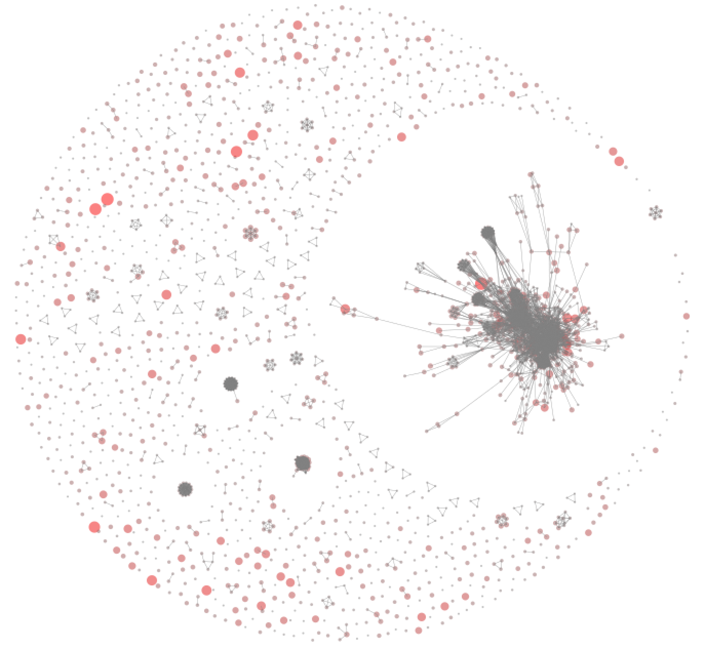
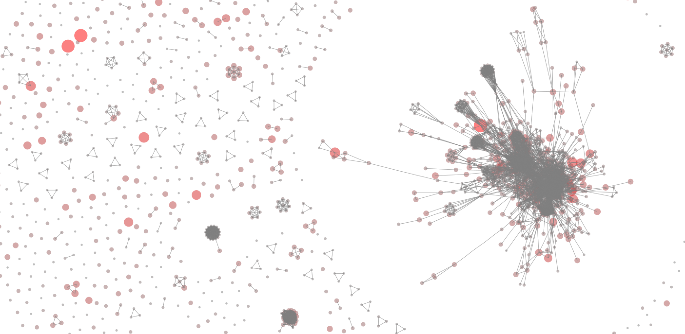
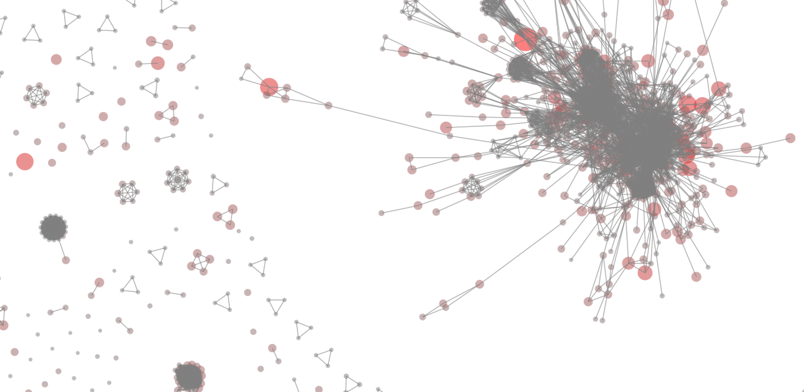

# UMLDiagramAnalysis
SATToSE 2018 Hackathon
Some info on: http://sattose.org/2018 and http://oss.models-db.com/Downloads/SATToSE2018_Hackathon/

Code written in Pharo

Here are some screenshots:

